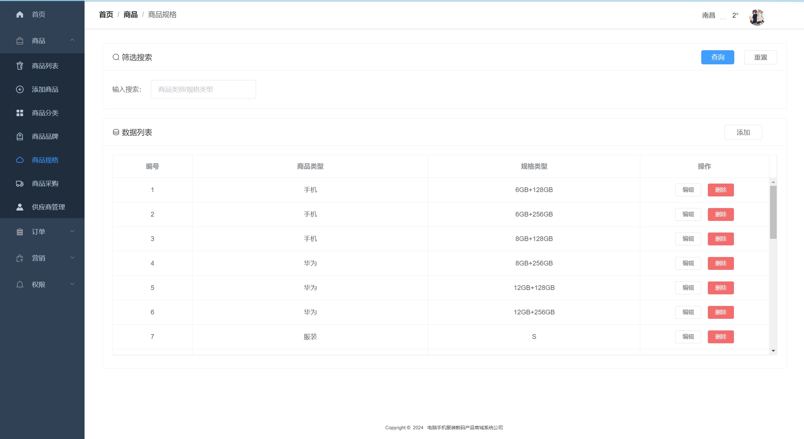

---
### 👉作者QQ ：1556708905 微信：zheng0123Long (支持修改、部署调试、定制毕设)

### 👉接网站建设、小程序、H5、APP、各种系统等

### 👉选题+开题报告+任务书+程序定制+安装调试+ppt 都可以做
---

**博客地址：
[https://blog.csdn.net/2303_76227485/article/details/136229378](https://blog.csdn.net/2303_76227485/article/details/136229378)**

**视频演示：
[https://www.bilibili.com/video/BV1cx421f7Yp/](https://www.bilibili.com/video/BV1cx421f7Yp/)**

**毕业设计所有选题地址：
[https://github.com/zhengjianzhong0107/allProject](https://github.com/zhengjianzhong0107/allProject)**

## 基于Java+Springboot+Vue的商城管理系统(源代码+数据库)127

## 一、系统介绍
本项目前后端分离，本系统分为管理员、用户两种角色

### 1、用户：
- 注册、登录、商品浏览、商品检索、商品下单、购物车、支付宝沙箱、个人中心、订单管理、开通VIP、个人收藏管理、密码修改
### 2、管理员：
- 订单统计、销售额统计、商品统计、商品管理、商品分类管理、品牌管理、规格管理、采购管理、供应商管理
- 订单管理、退货申请处理、订单发货、轮播图管理、用户管理、管理员管理、角色管理

## 二、所用技术

后端技术栈：

- Springboot
- Mybatis
- Mysql
- 支付宝沙箱
- redis

前端技术栈：

- Vue 
- Vue-router 
- axios 
- element-ui

## 三、环境介绍

基础环境 :IDEA/eclipse, JDK1.8, Mysql5.7及以上,Maven3.6, node14, 支付宝沙箱账号, redis5.0

所有项目以及源代码本人均调试运行无问题 可支持远程调试运行

## 四、页面截图
### 1、用户

### 2、管理员：

## 五、浏览地址

前台访问地址：http://localhost:8080/
- 用户账号/密码：1556708905@qq.com/123456
- 管理员账号/密码：admin@qq.com/admin

## 六、部署教程
1. 使用Navicat或者其它工具，在mysql中创建对应名称的数据库，并执行项目的sql文件；
2. 使用IDEA/Eclipse导入Springboot-Mall项目，若为maven项目请选择maven，等待依赖下载完成；
3. 进入src/main/resources修改application-jdbc.yml里面的数据库配置，application-redis.yml里面的redis配置
   config.properties里面的异步回调地址配置和com/qiu/config/AlipayConfig.java里面的支付宝沙箱配置
4. 启动项目后端项目
5. vscode或idea打开Vue-Mall项目，
6. 在编译器中打开terminal，执行npm install 依赖下载完成后执行 npm run serve,执行成功后会显示前台访问地址

所有验证码 都是 123456
